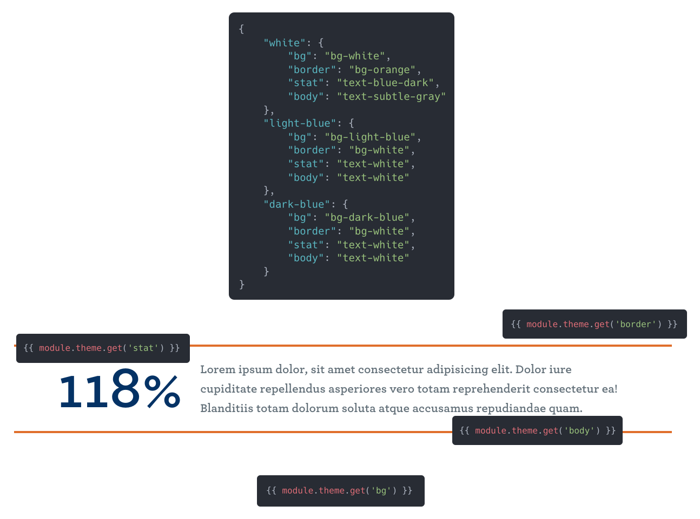

# Design Tokens

## 🤔 What is this?
Design Tokens is a Craft dropdown fieldtype where the options and the values are controllable via JSON files.

If you use Tailwind the JIT process only runs against Tailwind values it finds in your filesystem. If you have a class like `bg-indigo-700` in your database there's nothing Tailwind can do to find that (unless you enable Project Config, but do you _really_ want Tailwind crawling your Project Config?).

Design Tokens allows you to define the values within JSON files on your filesystem, making it possible to use Tailwind's JIT process and provide a simple way to add and edit new values to your dropdowns.

## ⚠️ Careful, though!

Editing these JSON files means it's possible to break the output of your data. For example:

```diff
{
  "standard": "my-12",
+ "tighter": "my-6",
- "tight": "my-6",
  "none": "my-0"
}
```

Changing "tight" to "tighter" would break any entry using "tight"! Now when it tries to locate the value of "tight" it will come up empty until you've changed all of those values.

## 📝 Usage

To setup configurations, create individual JSON files within `config/designtokens`.

### A single key/value pair (Ex: `spacing.json`)

```json
{
  "standard": "my-12",
  "tight": "my-6",
  "none": "my-0"
}
```

```twig
{{ entry.myTokenField }}
{# Outputs the value of the selected option (my-12, my-6, my-0) #}
```

```twig
{{ entry.myTokenField.key }}
{# Outputs the key of the selected option (standard, tight, none) #}
```

### A nested key/value pair (Ex: `hero.json`)

```json
{
  "red": {
    "text": "text-red-500",
    "bg": "bg-red-100"
  },
  "green": {
    "text": "text-green-500",
    "bg": "bg-green-100"
  },
  "blue": {
    "text": "text-blue-500",
    "bg": "bg-blue-100"
  }
}

```

```twig
{{ entry.myTokenField.key }}
{# Outputs the key of the selected option (red, green, blue) #}
```

```twig
{{ entry.myTokenField.get('text') }}
{# Outputs the nested value of the selected option (text-red-500, text-green-500, text-blue-500) #}

{{ entry.myTokenField.get('bg') }}
{# Outputs the nested value of the selected option (bg-red-100, bg-green-100, bg-blue-100) #}
```

## 🪄 Example

Rather than using many Twig conditions to render the properly selected colors you can use Design Tokens to easily pluck the value you need and insert the class into your respective HTML.



## 📦 Installing

Install Design Tokens in one of two ways:
- [Install via Craft's Plugin Store](https://plugins.craftcms.com/design-tokens)
- Run `composer require trendyminds/design-tokens` and enable the plugin from "Settings > Plugins"

## 🤝 Contributing

If you'd like to contribute please submit a pull request for review. We try to review and accept contributions whenever possible!
